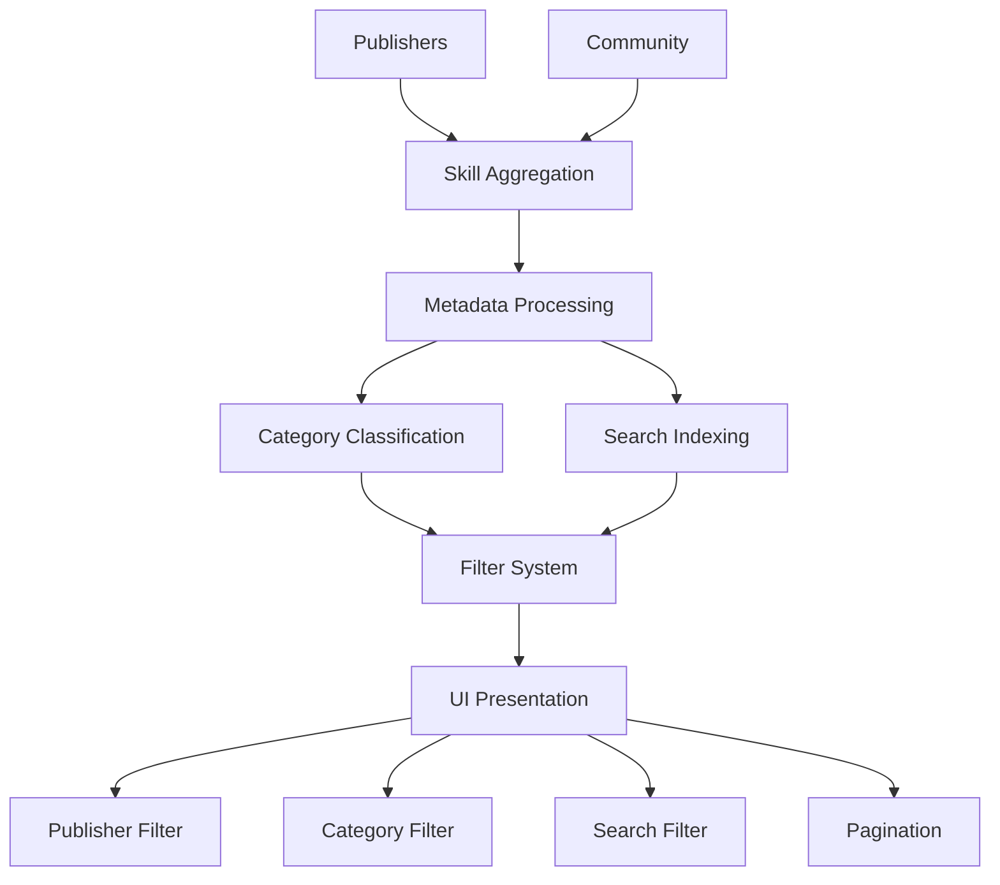
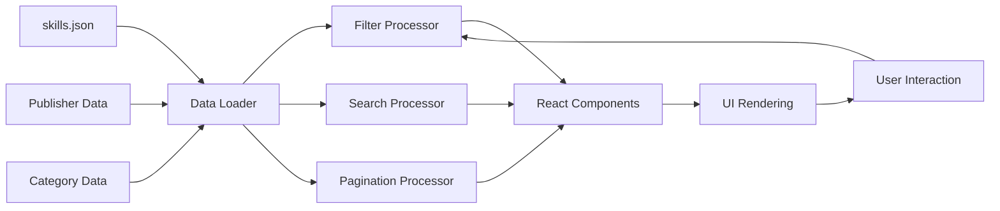
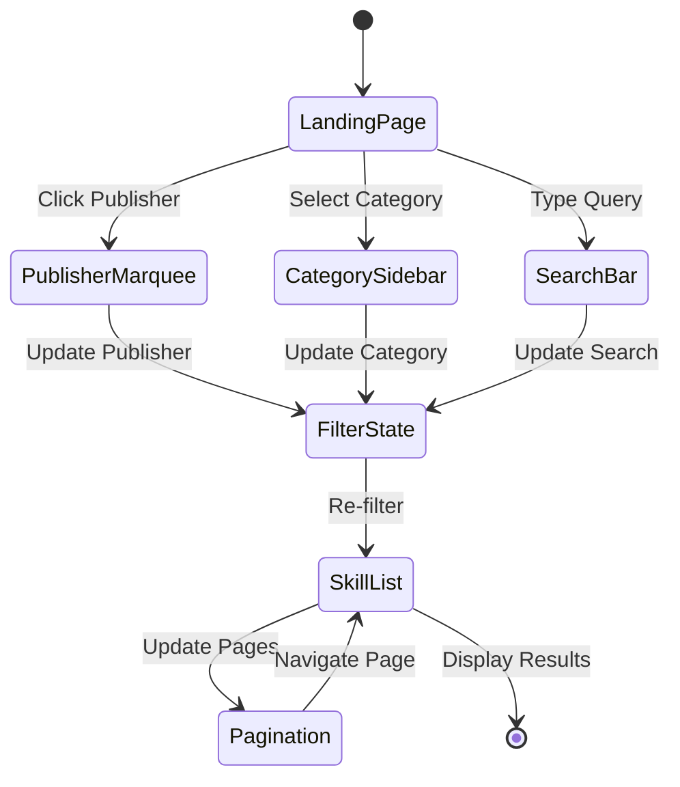
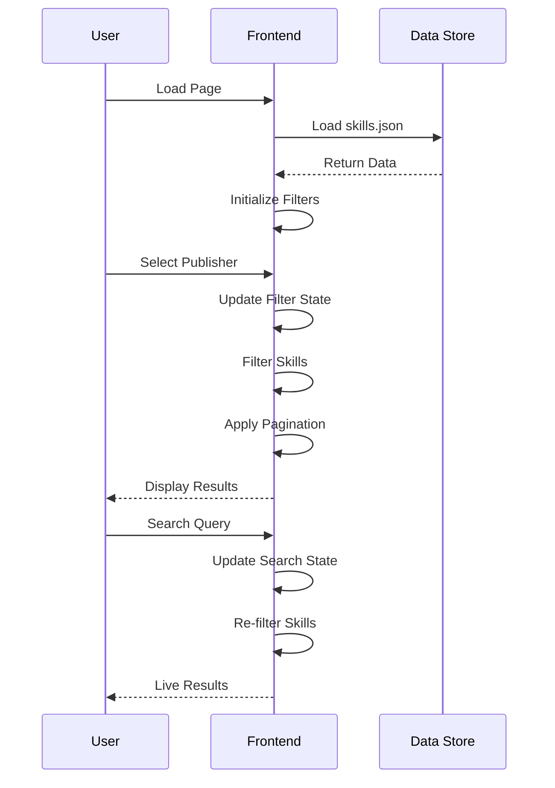

# Alana Multi-Skill Agent Directory


[](https://x.com/alanamultiskill)

CA: [TBD]

This is a comprehensive directory for AI agent skills from various publishers and developers. The goal of this project is to provide a centralized hub for discovering, exploring, and installing skills for AI agents. This project is for **educational** purposes and to facilitate the development of AI agent capabilities.

This system aggregates skills from multiple publishers:

1. Microsoft - Official skills from Microsoft's dev teams
2. OpenAI - Skills related to OpenAI's ecosystem
3. Anthropic - Skills for Anthropic's AI models
4. Google Workspace - Integration skills for Google services
5. Auth0 - Authentication and security skills
6. Flutter - Mobile development skills
7. Trail of Bits - Security-focused skills
8. Garry Tan - Community skills from Garry Tan
9. Fal AI Community - AI community skills
10. Apollo GraphQL - GraphQL and API skills
11. And many more publishers...

## Overview

**Alana Multi-Skill Agent Directory** brings together skills from official dev teams and community contributors. Using a clean, searchable interface, this terminal provides access to hundreds of skills for AI agents.

## Features

- Skill Discovery - Browse skills by publisher, category, or search
- Multi-Publisher Support - Skills from 49+ publishers
- Category Filtering - 9 categories including Infrastructure, Development, AI Tools, Security, etc.
- Search Functionality - Find skills by name or description
- Pagination - Navigate through large skill lists efficiently
- Publisher Marquee - Quick access to publisher skills
- Responsive Design - Works on desktop and mobile

## Technical Architecture

### Skill Aggregation System Flow
The skill aggregation system represents a comprehensive directory management platform that collects and organizes skills from multiple sources:

**Data Collection Layer:**
- Publisher Repositories - Official skills from vendor dev teams
- Community Contributions - Handpicked community-adopted skills
- Metadata Processing - Skill descriptions, categories, and dependencies

**Organization Layer:**
- Publisher Grouping - Skills organized by publishing entity
- Category Classification - Skills categorized by functionality (Infrastructure, AI Tools, etc.)
- Search Indexing - Full-text search across names and descriptions

**Presentation Layer:**
- Filter System - Publisher, category, and search filters
- Pagination - Efficient browsing of large skill sets
- Responsive UI - Clean interface with hover effects and transitions



### Data Pipeline Architecture
The data pipeline represents a static content management system that processes skill metadata for efficient browsing:

**Ingestion Layer:**
- JSON Data Sources - Skills stored in structured JSON format
- Publisher Metadata - Logo URLs, GitHub links, skill counts
- Category Definitions - Color-coded categories with counts

**Processing Layer:**
- Filter Logic - Client-side filtering by publisher, category, search
- Pagination Engine - Page-based navigation with configurable page sizes
- Search Engine - Real-time text matching across skill properties

**Delivery Layer:**
- React Components - Dynamic rendering of filtered results
- Responsive Design - Mobile-first approach with Tailwind CSS
- Performance Optimization - Efficient re-rendering with React hooks



### Component Interaction Diagram
This state diagram illustrates the complex interaction patterns between UI components during skill browsing:

**State Management:**
- Publisher Selection - Filters skills by selected publisher
- Category Selection - Filters skills by selected category
- Search Input - Real-time filtering by text query
- Page Navigation - Pagination state management

**Component Flow:**
1. User selects publisher from marquee → Filter state updates
2. User chooses category from sidebar → Filter state updates
3. User types in search box → Real-time filtering
4. User navigates pages → Pagination updates
5. Filtered results display → Skill list re-renders



### API and Data Flow
The application follows a static data approach with client-side processing:

**Data Structure:**
- Skills Array - 562+ skills with metadata
- Publishers Array - 49 publishers with logos and counts
- Categories Array - 9 categories with colors and counts

**Processing Flow:**
1. Component mounts → Load skills.json data
2. User interacts with filters → Update state
3. State changes → Recompute filtered skills
4. Pagination applied → Slice skills array
5. Render results → Display paginated list

This architecture ensures fast, client-side filtering without API calls, providing instant search and filter responses.



## Tech Stack

- **Framework:** Next.js 14 (App Router)
- **Language:** TypeScript
- **Styling:** Tailwind CSS
- **Data:** JSON-based skill directory
- **Icons:** Custom favicon and logos

## Getting Started

### Prerequisites

- Node.js 18+
- pnpm (or npm/yarn)

### Installation

```bash
# Clone the repository
git clone https://github.com/yourusername/alanamultiskillagent.git
cd alanamultiskillagent

# Install dependencies
pnpm install

# Start development server
pnpm dev
```

Open [http://localhost:3000](http://localhost:3000) to view the app.

## Project Structure

```
src/
├── app/
│   ├── page.tsx               # Main landing page with filters
│   ├── layout.tsx            # Root layout with favicon
│   ├── [publisher]/
│   │   ├── page.tsx          # Publisher overview
│   │   └── skills/
│   │       ├── page.tsx      # Publisher skills list
│   │       └── [slug]/
│   │           └── page.tsx  # Individual skill page
│   ├── about/
│   │   └── page.tsx          # About page
│   └── globals.css           # Global styles
├── components/
│   └── ...                   # Reusable components
├── data/
│   └── skills.json           # Skills database
└── lib/
    └── utils.ts              # Utility functions
```

## Data Structure

The skills data is stored in `src/data/skills.json` with the following structure:

```json
{
  "metadata": {
    "siteName": "Alana Multi-Skill Agent",
    "description": "Official skills from dev teams plus community skills",
    "totalSkills": 562,
    "totalPublishers": 49,
    "totalCategories": 9
  },
  "categories": [
    {
      "id": "infrastructure",
      "name": "Infrastructure",
      "count": 122,
      "color": "#3b82f6"
    }
  ],
  "publishers": [
    {
      "id": "microsoft",
      "name": "Microsoft",
      "skillsCount": 133,
      "logo": "https://github.com/microsoft.png?size=40"
    }
  ],
  "skills": [
    {
      "id": "skill-1",
      "name": "Skill Name",
      "description": "Skill description",
      "publisher": "microsoft",
      "category": "infrastructure",
      "slug": "skill-slug"
    }
  ]
}
```

## Deployment

This app can be deployed to any static hosting platform:

1. **Vercel** (Recommended)
   - Connect your GitHub repo
   - Deploy automatically

2. **Netlify**
   - Drag & drop the build folder
   - Set build command: `npm run build`

3. **GitHub Pages**
   - Use GitHub Actions for deployment
   - Set build command: `npm run build && npm run export`

## Contributing

1. Fork the repository
2. Create a feature branch
3. Add your skills to `src/data/skills.json`
4. Test the changes
5. Submit a pull request

## License

MIT License - See [LICENSE](LICENSE) for details.

## Credits

- Inspired by officialskills.sh
- Built with Next.js and Tailwind CSS
- Icons from various publishers' GitHub profiles